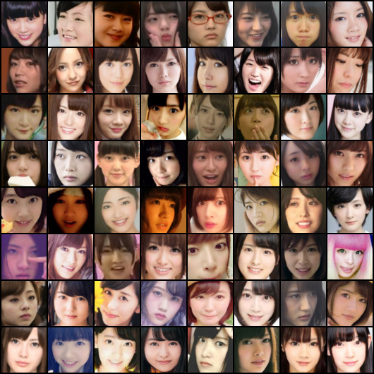
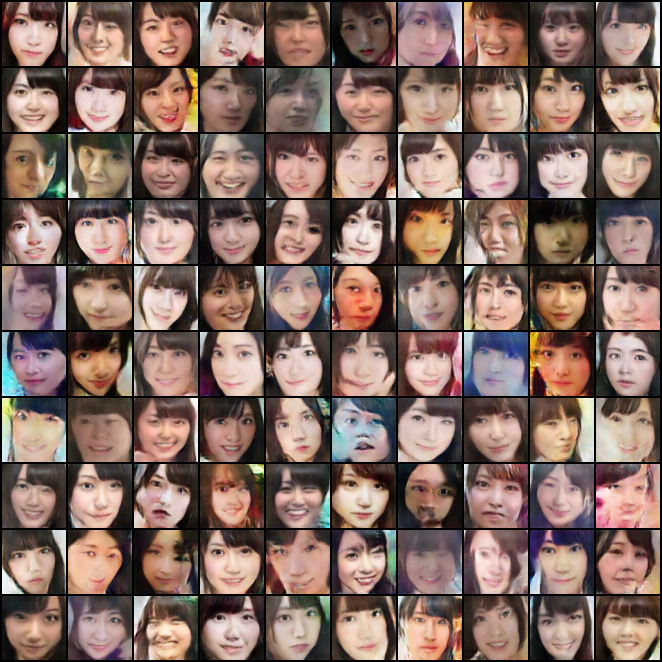
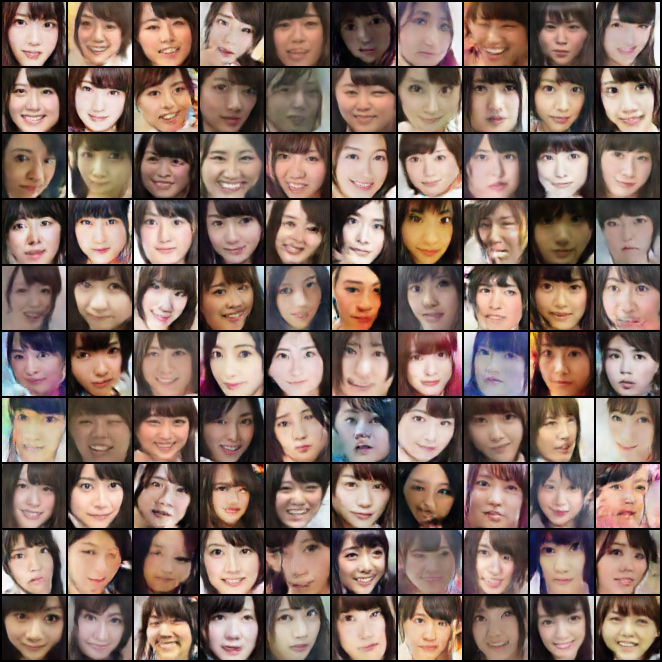

# pytorch-DCGAN-Humanface
## Introduction
This is a Pytorch implementation of  Deep Convolutional Generative Adversarial Networks (DCGAN) [2] for humanface datasets,witch can genarate some beautiful girls' face.

This project is inspired by this blog :https://zhuanlan.zhihu.com/p/26639135

* you can download the dataset from the url below:
  - HumanFace dataset: https://pan.baidu.com/share/init?surl=dERYUmH
  - with the password: 09h9
  - This dataset contains about 8000 girls‘ face images 


The main code structure is forked from https://github.com/pytorch/examples/tree/master/dcgan

---
## Implementation details
* The input and output image size of the neural network is  64 x 64 ,
* The learning rate is initialized as 0.0002，and reduces a half every 50 epoch. 
* The dimension of random noise is set to 1000. 
* For each iteration, we train the netD first for once and then train the netG for twice.
* We trained this network for 300 epoch and got the final result below.


---


## Results

* Generate using fixed noise (fixed_z_)

<table align='center'>
<tr align='center'>
<td> Training image</td>lt
<td> Result image</td>
</tr>
<tr>
<td>
<td>
</tr>
</table>

  

* Real image vs Generated images

<table align='center'>
<tr align='center'>
<td> Real image </td>
<td> DCGAN after 50 epochs </td>
<td> DCGAN after 150 epochs </td>
</tr>
<tr>
<td>
<td>
<td>
</tr>
</table>


* Learning Time
  * Humanface DCGAN - about 10 sec per epoch, 300 epoch takes nearly 50 minutes ( If you want to reduce the training time, set the dimension of the noise to 100，then the epoch time is about 7 sec,in my development environment.)

* Results
 * Model: You can find the final trained model in the "checkpoints " folder
 * Logs: You can get the training log in the "logs " folder


---
## Usage

* Data

``` 
You should download the dataset showed above, and unzip the dataset to the same folder witch contains the main.py file
```
* Run

``` 
usage: main.py [-h] [--dataset DATASET] [--dataroot DATAROOT]
               [--train_image_list TRAIN_IMAGE_LIST] [--workers WORKERS]
               [--batchSize BATCHSIZE] [--imageSize IMAGESIZE] [--nz NZ]
               [--ngf NGF] [--ndf NDF] [--niter NITER] [--lr LR]
               [--decay_round DECAY_ROUND] [--beta1 BETA1] [--cuda CUDA]
               [--ngpu NGPU] [--netG NETG] [--netD NETD] [--outpics OUTPICS]
               [--outckpts OUTCKPTS] [--outlogs OUTLOGS]
               [--manualSeed MANUALSEED]

optional arguments:
  -h, --help            show this help message and exit
  --dataset DATASET     cifar10 | lsun | imagenet | folder | lfw | fake
  --dataroot DATAROOT   path to dataset
  --train_image_list TRAIN_IMAGE_LIST
                        pics path lists
  --workers WORKERS     number of data loading workers
  --batchSize BATCHSIZE
                        input batch size
  --imageSize IMAGESIZE
                        the height / width of the input image to network
  --nz NZ               size of the latent z vector
  --ngf NGF             number of the filter of generate network
  --ndf NDF             number of the filter of descriminator network
  --niter NITER         number of epochs to train for
  --lr LR               learning rate, default=0.0002
  --decay_round DECAY_ROUND
                        learning rate decay 0.5 each decay_round
  --beta1 BETA1         beta1 for adam. default=0.5
  --cuda CUDA           enables cuda
  --ngpu NGPU           number of GPUs to use
  --netG NETG           path to netG (to continue training)
  --netD NETD           path to netD (to continue training)
  --outpics OUTPICS     folder to output images
  --outckpts OUTCKPTS   folder to output checkpoints
  --outlogs OUTLOGS     folder to output images
  --manualSeed MANUALSEED  manual seed
```


---  
## Development Environment

* Ubuntu 14.04 LTS
* NVIDIA GTX 1080 ti
* cuda 8.0
* Python 3.5
* pytorch 0.3.0
* torchvision 0.2.0


---
##Some  Reference

[1] Goodfellow, Ian, et al. "Generative adversarial nets." Advances in neural information processing systems. 2014.

(Full paper: http://papers.nips.cc/paper/5423-generative-adversarial-nets.pdf)

[2] Radford, Alec, Luke Metz, and Soumith Chintala. "Unsupervised representation learning with deep convolutional generative adversarial networks." arXiv preprint arXiv:1511.06434 (2015).

(Full paper: https://arxiv.org/pdf/1511.06434.pdf)

[3] Y. LeCun, L. Bottou, Y. Bengio, and P. Haffner. "Gradient-based learning applied to document recognition." Proceedings of the IEEE, 86(11):2278-2324, November 1998.

[4] Liu, Ziwei, et al. "Deep learning face attributes in the wild." Proceedings of the IEEE International Conference on Computer Vision. 2015.
